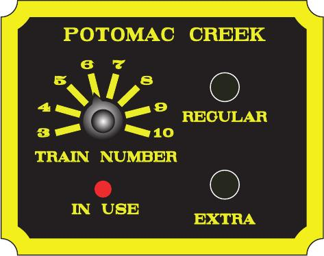

# usmrr-telegraph-sounder

This project holds source code and documentation for the Telegraph Sounder for Bernie
Kempinski's USMRR Aquia Line model railroad (http://usmrr.blogspot.com/).  Bernie's layout
models the US Military Railroad in 1863 during the height of the US Civil War.

The telegraph sounder system for Bernie's layout consists of five train order stations
connected to the dispatcher's office. At each station, there is a small control panel
embedded in the layout fascia resembling the image below.

## User Interface

The user interface for this project is very simple. The crew of a train arriving at a
station waits for the BUSY lamp to be off, selects their train number with the rotary
switch and then presses either the "REGUAR" or "EXTRA" train button, as appropriate for
their train. When either of those buttons is pressed, the BUSY lamp will start to blink
out the
[USMRR dot code](http://www.unitedstatesmilitarytelegraph.org/files/cheatsheet.pdf) for
the OS message for the train, and simultaneously, the BUSY lamps on all of the other
station platforms will illuminate solidly.

In the dispatcher's office, the telegraph sounder will start thunking away, playing the
dot code of the train OS report. As a visual indicator of which station is calling (and a
cheat for the dispatcher), the active station's LED on the dispatcher's control panel will
also blink out the sounder activity.

The sounder will continue to play the OS message until one of the following events
happens:

 * the dispatcher presses the "STOP" button for the station, or
 * the train crew rotates the train selector knob, or
 * the train crew presses either the "REGULAR" and "EXTRA" train button
 
At this point, the station will go back to IDLE and the BUSY lamp will turn off.

## Hardware

The hardware at each station consists of the fascia control panel with the rotary switch,
BUSY lamp (LED), and "REGULAR" and "EXTRA" push buttons, along with a
[Model Railroad Control Systems "Morse Code Buzzer Board"]
(http://www.modelrailroadcontrolsystems.com/morse-code-buzzer-board/) which uses an
Arduino Pro-Mini embedded microcontroller. One possible schematic of the connection of the
fascia panel to the Morse Code Buzzer Board is shown below:

[Station Panel Schematic](images/station-panel-schematic.pdf)

In this schematic, the interface between each station board and the dispatcher's office
requires 5 signals:

  * Vsounder -- the sounder power supply voltage
  * GND -- the sounder power supply ground
  * SOUNDER\_OUT\_L -- an active-low, open collector output to drive the sounder
  * BUSY\_OUT\_L -- an active-low, open collector output to be wire-ORed in the dispatcher's office and pulled high to Vsounder
  * STOP\_IN\_L -- an active-low digital input from a normally open push button in the dispatcher's office that connects to GND when pressed.

In the dispatcher's office, all of the "SOUNDER\_OUT\_L" lines from the stations are
connected to the vintage telegraph sounder through a diode stack with an LED in parallel
with each station so that the dispatcher can see at a glance which station is calling. The
dispatcher also has a set of "STOP" buttons, one for each station, which connect back to
the STOP_L inputs at the corresponding station.

The BUSY\_OUT\_L lines from all of the stations are wire-ORed in the dispather's office
and pulled high through a 10 kOhm pull-up resistor to the sounder's positive supply
voltage (V\_SOUNDER). This allows any station to pull its BUSY\_OUT\_L line low and cause
all of the other stations to see their BUSY\_IN\_L go low to signal that the line is busy.

[insert dispatcher schematic here]

Back at the station board, we know that the two outputs to the dispatcher (SOUNDER\_OUT\_L
and BUSY\_OUT\_L) should be driven from the higher current capacity "LOAD" outputs. We
also know that we need one more output to drive the local "BUSY" LED on the fascia. All of
these outputs can come from the "load" pins, but the LED can be driven by one of the
"START" or "STOP" pins as well.

There are also 4 input signals we must have:

  * REGULAR\_IN\_L -- from the "REGULAR" button on the fascia panel
  * EXTRA\_IN\_L -- from the "EXTRA" button on the fascia panel
  * STOP\_IN\_L -- from the dispatcher
  * BUSY\_IN\_L -- looped over from the BUSY\_OUT\_L to allow us to know when a different station is busy

Assuming that we place all of the "must be output" pins on the LOAD connector which can
*only* be outputs, then we are left with only 14 pins which are capable of being inputs,
and 4 of those are spoken for.  That would leave us with a total of 10 more pins on the
Arduino Pro Micro which can be used as inputs, and we are trying to have 12 trains on the
selector knob.

In the schematic, we have chosen to "turn things around" and instead of trying to have the
train selector be multiple *inputs*, we tie the multiple train selector to 12 *output*
pins of the Arduino and use a simple scanning loop to pull each output pin low in a cycle
to see which one shows up as a low voltage at the single "TRAIN" input.

## Software

The software has been designed around a simple state machine as pictured below.

At power-on, each station will enter the ST\_IDLE state, de-asserting the BUSY\_OUT\_L and
SOUNDER\_OUT\_L and extinguishing the local BUSY lamp on the fascia panel.

### OSing a Train

When a train arrives at the station, the crew will use the rotary selector knob to select
their train number, and then wait for the BUSY lamp to go out. Then they will press and
release either the "REGULAR" or "EXTRA" button accoriding to their train. This will move
the station's state machine to the ST\_SOUNDING state.  While in this state, the station
will pull the BUSY\_OUT\_L line low to signal to the other stations that the line is busy
and will start to play the OS message for the train on the sounder. As the message plays,
the BUSY lamp on the local panel will blink on and off with each "dit" in the OS message
pattern.

The OS message for a REGULAR train is as follows:

WWW OS xx # (2212.2212.2212.3.12.121.3.<pause><station><train><333>

For an EXTRA, the message is:

WWW OS xx E# (2212.2212.2212.3.12.121.3.<pause><station>

### Canceling an in-progress OS

Once in the ST\_SOUNDING state, the station's train OS message will continue to play until
one of the following occurs:

 * the dispatcher presses the "STOP" button for the station
 * the train crew chenges the rotary train selector knob
 * the train crew presses either the "REGULAR" and "EXTRA" button

While this happens, all of the other station panels will see their BUSY\_IN\_L
signal asserted low and will prevent operators at those stations from starting
another train report.

# Station Configuration

All 5 stations have identical hardware and software. The only difference between the
stations is the label on the faceplate and a configuration record in the Arduino Pro
Mini's non-volatile EEPROM.

If the Arduino in a station panel has no configuration record saved, or if it loses its
mind due to an electrical glitch, it will enter ST_CONFIGURING:ERROR state. In this state,
it will send the dot-code "end of message" (3-3-3) on the sounder. You can also cause the
Arudino to re-enter the configuraiton state by holding either the REGULAR or EXTRA button
down as you apply power and continuing to hold the buttong until the fascia LED starts
blinking.

To set the station configuration, rotate the selector knob to one of the first 5 positions
according to the following table:

Train Selector | Station Code | Station Name
--------------|--------------|----------------
1 | AQ (11.2122) | Aquia Landing
2 | BR (1221.122) | Brooke
3 | PO (2121.12) | Potomac
4 | ST (121.1) | Stanaford
5 | FA (1112.11) | Fallbrook

As the train selector is move to these positions, the Arduino will sound the message "I AM
xx" (2.3.11.2112.3.xx.xx.333) to confirm the setting. When you have the correct station
selected, press and hold either the REGULAR or EXTRA button until the flashing stops to
confirm the selection.

Note: when re-configuring the station configurtation, it is easiest to follow the sequence
as follows:

1) turn power off
2) twist the train selector to a position other than 1, 2, 3, 4, or 5.
3) hold down the REGULAR or EXTRA button
4) turn power on
5) keep holding the button until you see the BUSY LED start to flash 333.
6) release the button
7) twist the train selector knob to the correct station
8) confirm the "I AM xx" message
9) press and hold either REFULAR or EXTRA button until the flashing stops.

